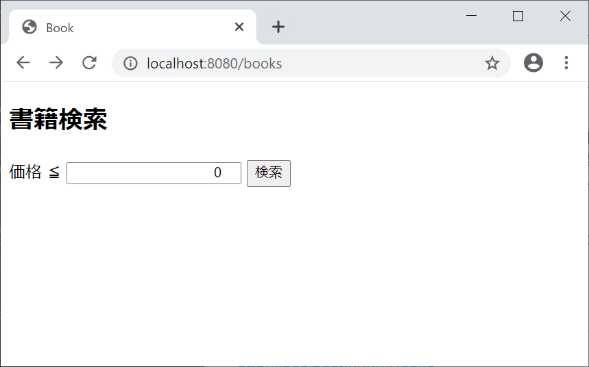
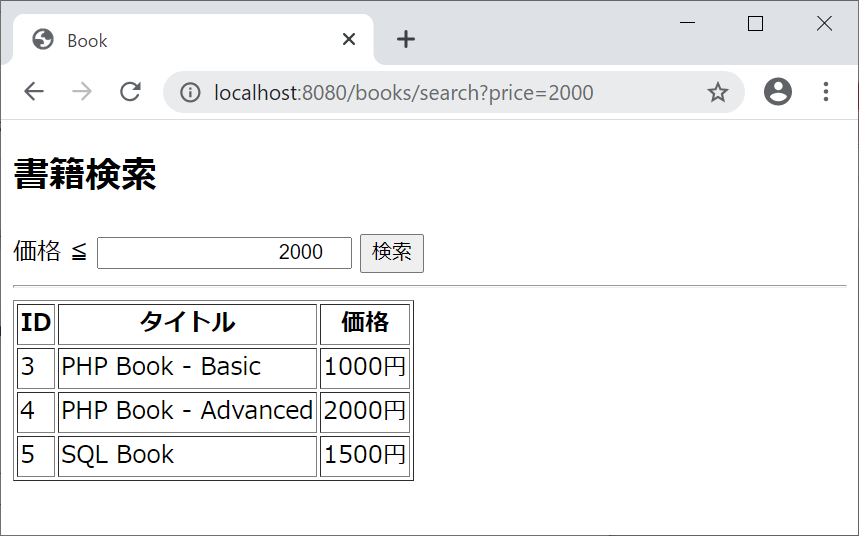
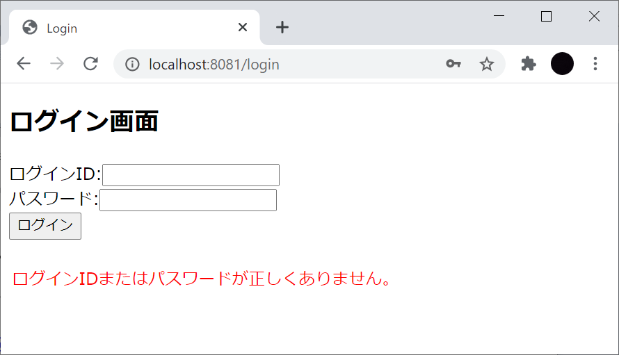
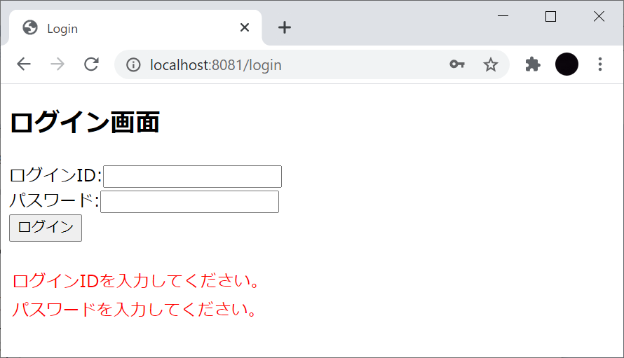

# Spring Framework 演習問題

Eclipse上で Spring Starterプロジェクト「spring-exercise」を作成して課題に取り組んでください。

<br>

### 演習1

次の実行結果となるように以下のプログラムを作成してください。

- ExRestControllerクラス（パッケージ：com.example.springexercise.controller）

#### 実行結果

ブラウザを開いて以下のURLにアクセスします。

http://localhost:8080/rest-controller/ex1


<br><br>

<hr>

### 演習2

次の実行結果となるように以下のプログラムを作成してください。

- ExRestControllerクラス（パッケージ：com.example.springexercise.controller）

> 既存のExRestControllerクラスにメソッドを追加してください。

#### 実行結果

ブラウザを開いて以下のURLにアクセスします。

http://localhost:8080/rest-controller/ex2

フルーツ名をリストに格納し、リストの内容を表示します。


<br><br>

<hr>

### 演習3

次の実行結果となるように以下のプログラムを作成してください。

- ExRestControllerクラス（パッケージ：com.example.springexercise.controller）

> 既存のExRestControllerクラスにメソッドを追加してください。

#### 実行結果

ブラウザを開いて以下のURLにアクセスします。

http://localhost:8080/rest-controller/ex3

フルーツ名と価格をマップに格納し、マップの内容を表示します。


<br><br>

<hr>

### 演習4

次の実行結果となるように以下のプログラムを作成してください。

- ExRestControllerクラス（パッケージ：com.example.springexercise.controller）

> 既存のExRestControllerクラスにメソッドを追加してください。

#### 実行結果

ブラウザを開いて以下のURLにアクセスします。

http://localhost:8080/rest-controller/ex4?message=SpringBoot!!

リクエストパラメータの値を表示します。


> ヒント：@RequestParamアノテーションでリクエストパラメータを取得できます。

<br><br>

<hr>

### 演習5

次の実行結果となるように以下のプログラムを作成してください。

- ExRestControllerクラス（パッケージ：com.example.springexercise.controller）
- Employeeクラス（パッケージ：com.example.springexercise.domain）　※作成済み

> 既存のExRestControllerクラスにメソッドを追加してください。

#### 実行結果

ブラウザを開いて以下のURLにアクセスします。

http://localhost:8080/rest-controller/ex5?id=101

リクエストパラメータで指定したIDで従業員情報（リスト）を検索し、ヒットした従業員の情報を表示します。


リクエストパラメータで指定したIDに紐づく従業員情報がない場合は、その旨のメッセージを表示します。


<br>

**Employee.java**

```java
package com.example.springexercise.domain;

import lombok.Data;

@Data
public class Employee {
    private int id;         // 従業員ID
    private String name;    // 氏名
    private String gender;  // 性別
    private int age;        // 年齢

    public Employee(int id, String name, String gender, int age) {
        this.id = id;
        this.name = name;
        this.gender = gender;
        this.age = age;
    }
}
```

<br>

**ExRestController.java**　※追加するメソッドに以下のリストが用意されているものとします。

```java
List<Employee> employees = Arrays.asList(new Employee(101, "Bob", "Male", 45),
                                         new Employee(102, "Alice", "Female", 32),
                                         new Employee(103, "John", "Male", 28),
                                         new Employee(104, "Gonzalez", "Male", 27),
                                         new Employee(105, "Paula", "Female", 36),
                                         new Employee(106, "Watson", "Male", 56),
                                         new Employee(107, "Eliza", "Female", 23),
                                         new Employee(108, "Duke", "-", 25));
```

<br><br>

<hr>

### 演習6

次の実行結果となるように以下のプログラムを作成してください。

- ExRestControllerクラス（パッケージ：com.example.springexercise.controller）
- Employeeクラス（パッケージ：com.example.springexercise.domain）　※作成済み

> 既存のExRestControllerクラスにメソッドを追加してください。

#### 実行結果

ブラウザを開いて以下のURLにアクセスします。

http://localhost:8080/rest-controller/ex6/101

パスパラメータで指定したIDで従業員情報（リスト）を検索し、ヒットした従業員の情報を表示します。


パスパラメータで指定したIDに紐づく従業員情報がない場合は、その旨のメッセージを表示します。


> ヒント：@PathVariableアノテーションでリクエストパラメータを取得できます。

<br><br>

<hr>

### 演習7

次の実行結果となるように以下のプログラムを作成してください。

- ExControllerクラス（パッケージ：com.example.springexercise.controller）
- even.html（配置場所：src/main/resources/templates/number）　※作成済み
- odd.html（配置場所：src/main/resources/templates/number）　※作成済み

#### 実行結果

ブラウザを開いて以下のURLにアクセスします。

http://localhost:8080/controller/ex7/2

パスパラメータで指定した数値が偶数の場合は偶数ページ（even.html）へ、奇数の場合は奇数ページ（odd.html）へフォワードします。


<br>

**even.html**

```html
<!DOCTYPE html>
<html>
<head>
<meta charset="UTF-8">
<title>Random</title>
</head>
<body style="background-color:red; color:white;">
    an even page.
</body>
</html>
```

<br>

**odd.html**

```html
<!DOCTYPE html>
<html>
<head>
<meta charset="UTF-8">
<title>Random</title>
</head>
<body style="background-color:blue; color:white;">
    an odd page.
</body>
</html>
```

<br><br>

<hr>

### 演習8

次の実行結果となるように以下のプログラムを作成してください。

- ExControllerクラス（パッケージ：com.example.springexercise.controller）
- employee.html（配置場所：src/main/resources/templates/ex8）

#### 実行結果

ブラウザを開いて以下のURLにアクセスします。

http://localhost:8080/controller/ex8

従業員画面（employee.html）へフォワードし、従業員情報（リスト）を全件表示します。


<br>

**ExRestController.java**　※追加するメソッドに以下のリストが用意されているものとします。

```java
List<Employee> employees = Arrays.asList(new Employee(101, "Bob", "Male", 45),
                                         new Employee(102, "Alice", "Female", 32),
                                         new Employee(103, "John", "Male", 28),
                                         new Employee(104, "Gonzalez", "Male", 27),
                                         new Employee(105, "Paula", "Female", 36),
                                         new Employee(106, "Watson", "Male", 56),
                                         new Employee(107, "Eliza", "Female", 23),
                                         new Employee(108, "Duke", "-", 25));
```

<br><br>

<hr>

### 演習9

次の実行結果となるように以下のプログラムを作成してください。

- ExControllerクラス（パッケージ：com.example.springexercise.controller）
- employee.html（配置場所：src/main/resources/templates/ex8）

#### 実行結果

ブラウザを開いて以下のURLにアクセスします。

http://localhost:8080/controller/ex9/101

パスパラメータで指定したIDで従業員情報（リスト）を検索し、ヒットした従業員の情報を従業員画面（employee.html）に表示します。


パスパラメータで指定したIDに紐づく従業員情報がない場合は、その旨のメッセージを表示します。


<br>

**ExRestController.java**　※追加するメソッドに以下のリストが用意されているものとします。

```java
List<Employee> employees = Arrays.asList(new Employee(101, "Bob", "Male", 45),
                                         new Employee(102, "Alice", "Female", 32),
                                         new Employee(103, "John", "Male", 28),
                                         new Employee(104, "Gonzalez", "Male", 27),
                                         new Employee(105, "Paula", "Female", 36),
                                         new Employee(106, "Watson", "Male", 56),
                                         new Employee(107, "Eliza", "Female", 23),
                                         new Employee(108, "Duke", "-", 25));
```

<br><br>

<hr>

### 演習10

次の実行結果となるように以下のプログラムを作成してください。

- LoggingAspectクラス（パッケージ：com.example.springexercise.aspect）

#### 実行結果

AOPを活用し、com.example.springexercise.controllerパッケージ配下の全クラスのメソッド実行時に、コンソールにログを出力します。出力内容は対象メソッドのパッケージ名、クラス名、メソッド名とします。

（出力例）

```
start:String com.example.springexercise.controller.ExRestController.ex4(String)
```

<br><br>

<hr>

### 演習11

次の実行結果となるように以下のプログラムを作成してください。

- LoggingAspectクラス（パッケージ：com.example.springexercise.aspect）

#### 実行結果

AOPを活用し、com.example.springexercise.controllerパッケージ配下の全クラスで、引数が1つ以上あるメソッドの実行時に、コンソールにログを出力します。出力内容は対象メソッドのパッケージ名、クラス名、メソッド名とします。

（出力例）

```
start:String com.example.springexercise.controller.ExRestController.ex4(String)
```

> 引数が1つもないメソッドが実行された時は、ログ出力はしません。

<br><br>

<hr>

### 演習12

次の実行結果となるように以下のプログラムを作成してください。

- BookControllerクラス（パッケージ：com.example.springexercise.controller）
    - 書籍検索画面（index.html）に遷移します。
    - 書籍検索画面の入力情報（価格）をBookFormで受け取り、Serviceクラスの検索メソッドを呼び出します。
    - 検索結果を渡し、検索画面（index.html）へフォワードします。
- BookServiceインタフェース（パッケージ：com.example.springexercise.service）
    - 価格による書籍の検索メソッドを定義します。
- BookServiceImplクラス（パッケージ：com.example.springexercise.service）
    - 価格による書籍の検索メソッドを実装します。
    - 検索結果を返します。
- BookFormクラス（パッケージ：com.example.springexercise.form）
    - 書籍検索画面の入力情報を保持します。
- index.html（配置場所：src/main/resources/templates/book）
    - 書籍検索画面を表示します。
- Bookクラス（パッケージ：com.example.springexercise.domain）　※作成済み

#### 実行結果

ブラウザを開いて以下のURLにアクセスします。

http://localhost:8080/books



価格テキストボックスに入力した値で書籍情報（リスト）を検索し、ヒットした書籍の情報を書籍検索画面（index.html）の下部に表示します。



<br><br>

<hr>

### 演習13

演習10で検索結果が1件もない場合、その旨のメッセージを表示します。


<br>

**BookServiceImpl.java**　※検索メソッドに以下のリストが用意されているものとします。

```java
List<Book> books = Arrays.asList(new Book(1, "Java Book - Basic", 3500),
                                 new Book(2, "Java Book - Advanced", 5000),
                                 new Book(3, "PHP Book - Basic", 1000),
                                 new Book(4, "PHP Book - Advanced", 2000),
                                 new Book(5, "SQL Book", 1500),
                                 new Book(6, "JavaScript Book", 4000),
                                 new Book(7, "HTML/CSS Book", 3000),
                                 new Book(8, "Spring Framework Book", 10000));
```

<br>

**Book.java**

```java
package com.example.springexercise.domain;

import lombok.Data;

@Data
public class Book {
    private int id;         // ID
    private String title;   // タイトル
    private int price;      // 価格

    public Book(int id, String title, int price) {
        this.id = id;
        this.title = title;
        this.price = price;
    }
}
```

<br><br>

<hr>

### 演習14

次の実行結果となるように以下のプログラムを作成してください。

- LoginControllerクラス（パッケージ：com.example.springexercise.controller）
    - ログイン画面（login.html）に遷移します。
    - ログイン画面の入力情報（ログインID、パスワード）をUserFormで受け取り、Serviceクラスのログインメソッドを呼び出します。
    - 入力されたログインID、パスワードに一致するユーザ情報がある場合、セッションに取得したユーザ情報を格納し、MenuControllerクラスへリダイレクトします。
- LoginServiceインタフェース（パッケージ：com.example.springexercise.service）
    - ログインIDとパスワードでログイン処理をするメソッドを定義します。
- LoginServiceImpleクラス（パッケージ：com.example.springexercise.service）
    - ログイン処理を実装します。
    - 一致するユーザ情報を返します。
    - 一致するユーザ情報がない場合はNullを返します。
- UserFormクラス（パッケージ：com.example.springexercise.form）
    - ログイン画面の入力情報を保持します。
    - ログインIDが未入力の場合、「ユーザIDを入力してください。」と表示します。
    - パスワードが未入力の場合、「パスワードを入力してください。」と表示します。
- login.html（配置場所：src/main/resources/templates）
    - ログイン画面を表示します。
- MenuControllerクラス（パッケージ：com.example.springexercise.controller）　※作成済み
    - メニュー画面（menu.html）に遷移します。
- menu.html（配置場所：src/main/resources/templates）　※作成済み
    - メニュー画面を表示します。
- Userクラス（パッケージ：com.example.springexercise.domain）　※作成済み

#### 実行結果

ブラウザを開いて以下のURLにアクセスします。

http://localhost:8080/login


入力されたログインIDとパスワードに一致する情報がユーザ情報（リスト）にある場合、メニュー画面に遷移します。ログインしたユーザのユーザ名を表示します。


入力されたログインIDとパスワードに一致する情報がユーザ情報（リスト）にない場合、ログイン画面に遷移し、エラーメッセージを表示します。



ログインID、パスワードが未入力の場合、それぞれのエラーメッセージを表示します。



<br>

**LoginServletImpl.java**　※ログインメソッドに以下のリストが用意されているものとします。

```java
List<User> users = Arrays.asList(new User("Taro Yamada", "user01@example.com", "pass01"),
                                 new User("Hanako Sato", "user02@example.com", "pass02"),
                                 new User("Ichiro Suzuki", "user03@example.com", "pass03"));
```

<br>

**User.java**

```java
package com.example.springexercise.domain;

import lombok.Data;

@Data
public class User {
    private String userName;    // ユーザ名
    private String userId;      // ユーザID
    private String password;    // パスワード

    public User(String userName, String userId, String password) {
        this.userName = userName;
        this.userId = userId;
        this.password = password;
    }
}
```

<br>

**MenuController.java**

```java
package com.example.springexercise.controller;

import java.util.Arrays;

import javax.servlet.http.HttpSession;

import org.springframework.beans.factory.annotation.Autowired;
import org.springframework.stereotype.Controller;
import org.springframework.web.bind.annotation.GetMapping;
import org.springframework.web.bind.annotation.RequestMapping;
import org.springframework.web.servlet.mvc.support.RedirectAttributes;

import com.example.springexercise.domain.User;

@Controller
@RequestMapping("menu")
public class MenuController {

    @Autowired
    private HttpSession session;

    @GetMapping
    public String show(RedirectAttributes redirectAttributes) {
        User user = (User)session.getAttribute("user");
        if (user == null) {
            redirectAttributes.addFlashAttribute("errorList", Arrays.asList("セッションが切れました。再度ログインしてください。"));
            return "redirect:/login";
        }
        return "menu";
    }
}
```

<br>

**menu.html**

```html
<!DOCTYPE html>
<html xmlns:th="http://www.thymeleaf.org">
<head>
<meta charset="UTF-8">
<title>Menu</title>
</head>
<body>
    <h2>メニュー画面</h2>
    <div>こんにちは、<span th:text="${session.user.userName}"></span>さん</div>
    <ul>
        <li><a href="https://www.google.com/" target="_blank">Google</a></li>
        <li><a href="https://www.apple.com/jp/" target="_blank">Apple</a></li>
        <li><a href="https://ja-jp.facebook.com/" target="_blank">Facebook</a></li>
        <li><a href="https://www.amazon.co.jp/" target="_blank">Amazon</a></li>
    </ul>
</body>
</html>
```

<br><br>

<hr>

### 演習15

次の実行結果となるように以下のプログラムを作成してください。

- LogoutControllerクラス（パッケージ：com.example.springexercise.controller）
- menu.html（配置場所：src/main/resources/templates）

#### 実行結果


メニュー画面のログアウトリンクをクリックすることで、セッションを破棄し、LoginControllerクラスへリダイレクトします。

<br><br>

<hr>
